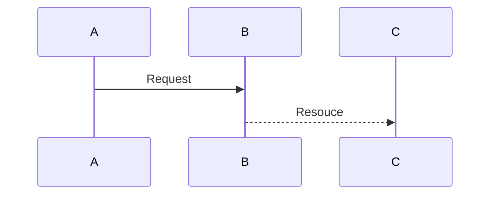

# DEVELOPMENT TODO LIST

### TODO LIST
1. [ ] Step1 Tasklet 개발 (Fetch using TourAPI3.0)
   - [ ] 데이터 페치중 지정한 시간 부터 현재 까지의 데이터 필터링  (`modifieddate` 필드값 이용  ex. 20180612100000)
   - [ ] 데이터를 특정파일로 임시 저장 (저장경로 지정, 저장 파일명 또는 패턴 지정)
   - [ ] 데이터 저장시 저장 포맷은 CSV (Delimiter - ";")
2. [ ] Step2
   - [ ] CSV 파일 로드

### Fetch Step

